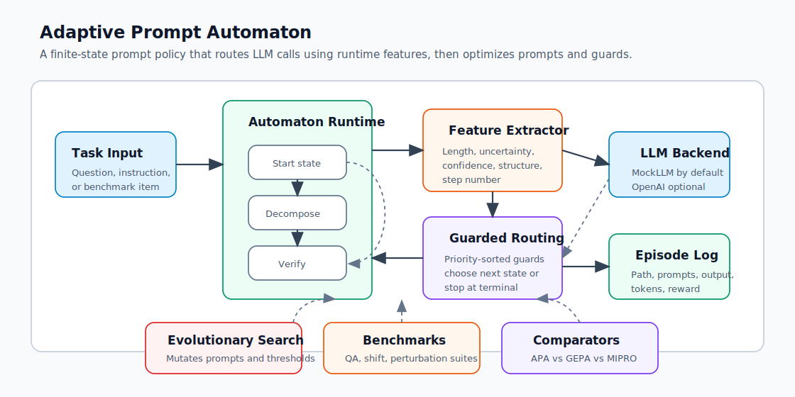
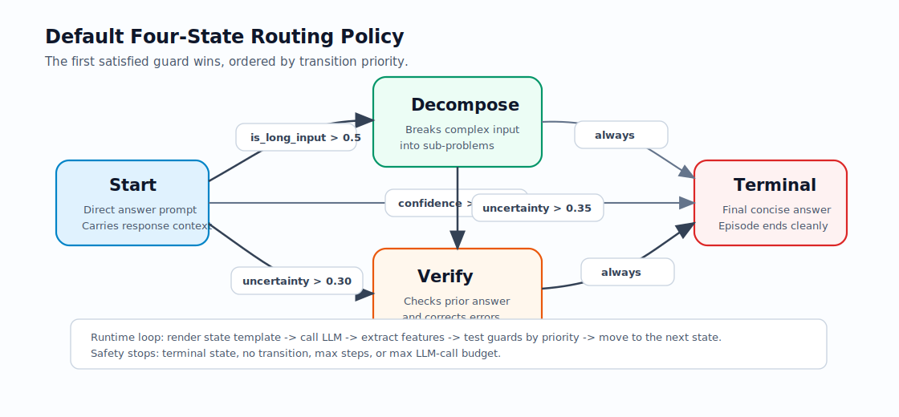

# Adaptive Prompt Automaton

Adaptive Prompt Automaton (APA) is a compact research/demo implementation of a stateful prompt policy for LLM workflows. Instead of sending every input through one static prompt, APA represents prompting as a finite-state automaton: each state owns a prompt template, each transition owns a guard condition, and runtime features decide which prompt should run next.

The result is a small but complete playground for testing when adaptive prompt routing helps: short questions can go straight to a final answer, uncertain answers can be verified, and long or multi-part tasks can be decomposed before the final response is produced.



## Why This Exists

Static prompts are simple, but they treat every task the same. Real inputs vary: some are short and factual, some are long and ambiguous, and some trigger hedged or low-confidence responses. APA makes that variation explicit by routing execution through different prompt states based on features extracted from the model output.

This repository demonstrates:

- A finite-state prompt runtime with explicit states, transitions, guard priorities, budgets, and episode logs.
- Feature extraction for length, uncertainty, confidence, structure, self-consistency, verifier score, tool status, and step number.
- Evolutionary search that mutates prompt templates and transition thresholds.
- Benchmark suites for mixed QA, distribution shift, and perturbation stability.
- Baseline comparison against a static one-state prompt.
- Additional GEPA-style and MIPRO-style local comparators for side-by-side experiments.
- A mock LLM backend for zero-key local demos, plus an optional OpenAI wrapper.

## Repository Status

This README describes the current lightweight implementation in this working tree:

```text
adaptive_prompt_automaton/
  core/
    automaton.py      # State, Transition, Automaton config and runtime objects
    executor.py       # Episode loop and execution records
    features.py       # Runtime feature extraction
  eval/
    benchmarks.py     # Task suites and composite reward
  search/
    evolution.py      # APA evolutionary optimization
    gepa.py           # GEPA-style reflective prompt evolution comparator
    mipro.py          # MIPRO-style instruction/demo optimizer comparator
  utils/
    api.py            # MockLLM and optional OpenAI adapter
compare.py            # APA vs GEPA vs MIPRO benchmark comparison
run_demo.py           # End-to-end APA demo
```

There is currently no `pyproject.toml` in this working tree, so the simplest setup is to install the few direct runtime dependencies into a virtual environment and run scripts from the repository root.

## Core Idea

An APA is made of four pieces:

| Piece | Purpose | Current implementation |
|---|---|---|
| `StateConfig` | Defines a prompt node: template, role, token cap, terminal flag, and context behavior. | `adaptive_prompt_automaton/core/automaton.py` |
| `TransitionConfig` | Defines a directed edge with a guard over a feature value. | `adaptive_prompt_automaton/core/automaton.py` |
| `FeatureExtractor` | Converts `(task_input, llm_output, step)` into normalized routing signals. | `adaptive_prompt_automaton/core/features.py` |
| `AutomatonExecutor` | Runs one episode until a terminal state, budget limit, missing transition, or error. | `adaptive_prompt_automaton/core/executor.py` |

The default demo builds this four-state topology:



## Runtime Flow

For each episode, the executor performs the same loop:

1. Start from `automaton.start_state`.
2. Render the current state's prompt template with `{input}` and carried `{context}`.
3. Call the configured LLM backend.
4. Extract a `FeatureVector` from the input and output.
5. Test outgoing transitions from the current state in priority order.
6. Move to the first target whose guard fires.
7. Stop when a terminal state is reached, no transition fires, the max-step limit is hit, or the LLM-call budget is exhausted.

Each step is captured as an `ExecutionStep`, and the full run is returned as an `Episode` containing the path, prompts, responses, features, token usage, final output, reward, and termination reason.

## Installation

Use Python 3.10 or newer.

```bash
cd APA

python3 -m venv .venv
source .venv/bin/activate

pip install --upgrade pip
pip install pydantic rich tqdm openai
```

The `openai` package is optional if you only use the default mock backend, but installing it keeps the optional `OpenAILLM` adapter available.

## Quick Start

Run the full APA demo:

```bash
python run_demo.py
```

The demo:

1. Builds the default four-state automaton.
2. Runs sample episodes and prints the route taken by each task.
3. Builds QA, distribution-shift, and perturbation benchmarks.
4. Evaluates a static prompt baseline.
5. Trains APA with evolutionary search.
6. Evaluates the trained automaton.
7. Prints path statistics and performance summaries with Rich tables.

Run the three-way comparison:

```bash
python compare.py
```

`compare.py` trains and evaluates:

| Method | What it represents | Runtime behavior |
|---|---|---|
| APA | Stateful finite-state prompt policy with evolutionary mutation. | Branches at inference time. |
| GEPA-style comparator | Reflective prompt evolution using actionable side information. | Keeps the automaton structure, evolves prompt wording. |
| MIPRO-style comparator | Instruction and few-shot demo search. | Produces a static one-state prompt. |

## Using APA From Python

Create an automaton, an LLM backend, a feature extractor, and an executor:

```python
from adaptive_prompt_automaton.core.automaton import (
    Automaton,
    AutomatonConfig,
    StateConfig,
    TransitionConfig,
)
from adaptive_prompt_automaton.core.executor import AutomatonExecutor
from adaptive_prompt_automaton.core.features import FeatureExtractor
from adaptive_prompt_automaton.utils.api import get_llm_api

states = {
    "start": StateConfig(
        state_id="start",
        name="Start",
        template="Answer this question clearly: {input}",
        is_terminal=False,
        carry_context=True,
    ),
    "verify": StateConfig(
        state_id="verify",
        name="Verify",
        template="Verify this answer.\nQuestion: {input}\nAnswer: {context}",
        is_terminal=False,
        carry_context=True,
    ),
    "terminal": StateConfig(
        state_id="terminal",
        name="Terminal",
        template="Final answer for {input}:\n{context}",
        is_terminal=True,
        carry_context=False,
    ),
}

transitions = [
    TransitionConfig(
        source_state="start",
        target_state="verify",
        feature_name="uncertainty_score",
        operator=">",
        threshold=0.30,
        priority=2,
    ),
    TransitionConfig(
        source_state="start",
        target_state="terminal",
        feature_name="answer_confidence",
        operator=">=",
        threshold=0.70,
        priority=1,
    ),
    TransitionConfig(
        source_state="verify",
        target_state="terminal",
        guard_type="always",
        operator="always",
    ),
]

automaton = Automaton(
    AutomatonConfig(
        name="MinimalAPA",
        start_state="start",
        states=states,
        transitions=transitions,
        max_steps=4,
        max_budget=4,
    )
)

llm = get_llm_api("mock", uncertainty_rate=0.25, seed=42)
extractor = FeatureExtractor(long_input_threshold=120)
executor = AutomatonExecutor(automaton, llm, extractor)

episode = executor.run_episode("Explain binary search in one paragraph.")
print(episode.summary())
print(episode.final_output)
```

## Optional Real LLM Backend

The default scripts use `MockLLM`, which needs no API key and gives deterministic-enough behavior for local experiments. To use the optional OpenAI adapter in your own code:

```bash
export OPENAI_API_KEY="your_api_key_here"
```

```python
from adaptive_prompt_automaton.utils.api import get_llm_api

llm = get_llm_api("openai", model="<chat-completions-compatible-model>")
```

If `OPENAI_API_KEY` is not set, `get_llm_api("openai", ...)` falls back to `MockLLM`.

## Feature Signals

`FeatureExtractor.extract(...)` currently returns these normalized signals:

| Feature | Meaning | Typical use |
|---|---|---|
| `input_length` | Input word count normalized to `[0, 1]`. | Detect broad task complexity. |
| `is_long_input` | `1.0` when input crosses the configured length threshold. | Route long tasks to decomposition. |
| `output_length` | Output word count normalized to `[0, 1]`. | Penalize very short or verbose answers. |
| `uncertainty_score` | Proxy based on hedging phrases such as "possibly" or "not sure". | Route uncertain answers to verification. |
| `answer_confidence` | `1 - uncertainty_score`. | Route confident answers to terminal. |
| `self_consistency` | Mean pairwise Jaccard overlap across optional sampled responses. | Reward stable answers. |
| `has_structured_format` | Detects bullets, numbered lists, code fences, equations, labels, or step markers. | Reward structured reasoning. |
| `verifier_score` | External verifier score when supplied, otherwise confidence proxy. | Integrate judge/model feedback. |
| `tool_success` | `1.0`, `0.0`, or `0.5` for known success, failure, or unknown tool status. | Route based on tool outcomes. |
| `output_to_input_ratio` | Relative verbosity of the response. | Detect over/under-answering. |
| `step_number` | Current step normalized over five steps. | Route differently later in an episode. |

## Reward Function

`composite_reward(...)` in `eval/benchmarks.py` is intentionally simple and inspectable. It combines:

- Base reward for producing a non-trivial final answer.
- Bonus for structured reasoning markers.
- Bonus for clean terminal-state termination.
- Bonus for multi-step adaptive routing.
- Penalty for hedged final answers.
- Penalty for exceeding a token budget.

This makes the demo easy to run without external graders. For serious experiments, replace `composite_reward` with a task-specific metric or judge-backed scorer.

## Training With Evolutionary Search

`EvolutionarySearch` jointly optimizes:

- State prompt templates through wording swaps and instruction additions.
- Guard thresholds through bounded Gaussian perturbations.
- Candidate selection through elite retention, tournament selection, crossover, and mutation.

Minimal training pattern:

```python
from adaptive_prompt_automaton.search.evolution import EvolutionarySearch
from adaptive_prompt_automaton.eval.benchmarks import make_qa_benchmark, composite_reward

bench = make_qa_benchmark()

search = EvolutionarySearch(
    initial_automaton=automaton,
    llm_api=llm,
    feature_extractor=extractor,
    reward_fn=composite_reward,
    population_size=8,
    n_generations=10,
    mutation_rate=0.40,
    n_eval_tasks=5,
    seed=42,
)

best_automaton = search.run(bench.inputs())
print(best_automaton.summary())
```

## Benchmark Suites

The local benchmark module builds three small suites:

| Suite | Builder | Purpose |
|---|---|---|
| Mixed QA | `make_qa_benchmark()` | Easy factual, medium conceptual, and hard long-form tasks. |
| Distribution shift | `make_distribution_shift_benchmark()` | Clean train questions paired with longer/noisier test variants. |
| Perturbation | `make_perturbation_benchmark()` | Original, mildly paraphrased, and more technical variants. |

These benchmarks are not meant to be definitive public leaderboard tasks. They are fast local probes for routing behavior, robustness, and optimizer dynamics.

## Output You Should Expect

Both scripts render Rich tables and progress bars. Useful sections include:

- Automaton structure: state table, transition table, and topology tree.
- Episode traces: path, step features, transitions, tokens, and final output.
- Path statistics: frequency of observed routes and path entropy.
- Training history: best, mean, and worst fitness across generations.
- Method comparison: average rewards, robustness delta, training calls, and win counts.

Example path strings:

```text
start -> terminal
start -> verify -> terminal
start -> decompose -> terminal
start -> decompose -> verify -> terminal
```

## Troubleshooting

### `ModuleNotFoundError: No module named 'rich'`

Install the runtime dependencies:

```bash
pip install pydantic rich tqdm openai
```

### `ModuleNotFoundError: No module named 'adaptive_prompt_automaton'`

Run scripts from the repository root:

```bash
cd APA
python run_demo.py
```

For ad hoc Python snippets, either run them from the repo root or add the root to `PYTHONPATH`.

### The OpenAI backend uses the mock LLM

Set `OPENAI_API_KEY` before constructing the backend:

```bash
export OPENAI_API_KEY="your_api_key_here"
```

### Results vary between runs

The mock backend and search code use randomness. Pass explicit seeds where available and avoid changing `uncertainty_rate` if you need comparable runs.

## Development Notes

- The current code favors readability and experimentation over package polish.
- The mock backend is deliberately simple; it is useful for routing demos, not factual evaluation.
- The benchmark reward is heuristic; swap in real task metrics for meaningful research claims.
- Transition priority matters: when multiple guards fire, the highest-priority transition is selected.
- `max_steps` and `max_budget` are separate safety controls. `max_budget` limits LLM calls, while `max_steps` limits automaton loop iterations.

## Roadmap Ideas

- Restore packaging metadata for editable installs and console entry points.
- Add unit tests for routing, feature extraction, reward scoring, and search mutation.
- Persist training runs as JSONL artifacts for later analysis.
- Add graph export for arbitrary automata.
- Support richer feature sources such as verifier models, tool traces, retrieval status, and uncertainty from multiple samples.
- Add task-specific evaluators in place of the heuristic composite reward.

## License

No license file is currently present in this working tree. Add one before publishing or reusing this code outside private experiments.
