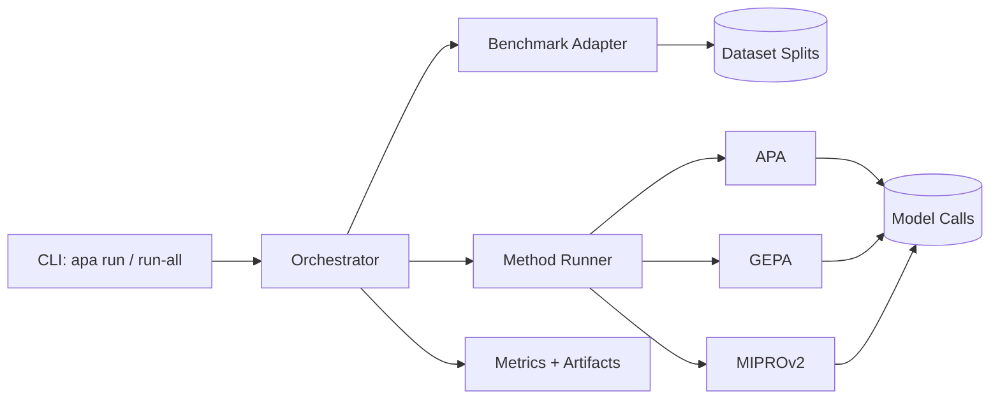
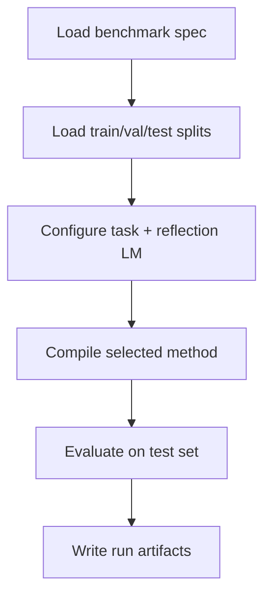
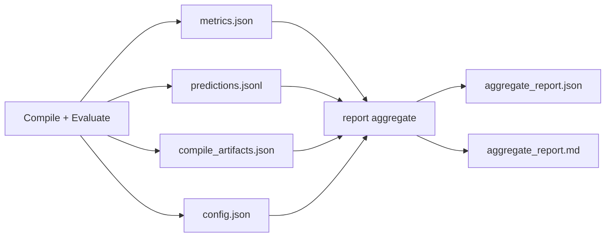

# APA (Adaptive Prompt Automaton)

A clean-room benchmark framework to compare:

- `apa` (this repo's method)
- `gepa` (official pip package, via DSPy)
- `miprov2` (official DSPy optimizer)

All methods are run with the same default model:

- `openai/gpt-4.1-mini-2025-04-14`

---

## 1) Quick Start (Copy-Paste)

```bash
# 1) Install
pip install -e .

# 2) Install full benchmark extras
pip install -e '.[retrieval,ifbench,livebench_math,dev]'

# 3) Set key
export OPENAI_API_KEY=...

# 4) See available benchmarks
apa benchmarks list

# 5) Run one benchmark
apa run --benchmark aime --method apa --seed 0
```

Run full matrix (6 benchmarks x 3 methods):

```bash
apa run-all --seed 0
```

Build aggregate report:

```bash
apa report aggregate
```

---

## 2) What This Repo Evaluates

### Methods

| Method | Implementation used |
|---|---|
| `apa` | Local implementation in `src/apa/core` + `src/apa/methods/apa_runner.py` |
| `gepa` | `dspy.GEPA(...)` + pip package `gepa` |
| `miprov2` | `dspy.MIPROv2(auto="heavy")` |

### Benchmarks (GEPA-6)

- `hotpotqa`
- `hover`
- `pupa`
- `ifbench`
- `livebench_math`
- `aime`

---

## 3) System Overview



---

## 4) Execution Flow (Single Run)



For `run-all`, this loop repeats for each `(benchmark, method)` pair until complete or cost cap is hit.

---

## 5) Fairness Rules (Important)

- Same default model for all methods.
- Same seed (`--seed 0` by default in your benchmark protocol).
- Benchmark-specific invocation caps are applied by default.
- Global run-all cost guardrail defaults to `$500`.
- Retrieval fallback is explicitly marked as non-canonical in metadata.

---

## 6) CLI Commands

List benchmarks:

```bash
apa benchmarks list
```

Run one benchmark:

```bash
apa run --benchmark ifbench --method apa --seed 0
apa run --benchmark hover --method gepa --seed 0
apa run --benchmark pupa --method miprov2 --seed 0
```

Run full matrix:

```bash
apa run-all --seed 0 --cost-cap-usd 500
```

Dry run (no expensive optimization/eval calls):

```bash
apa run --benchmark ifbench --method apa --dry-run
```

Aggregate report:

```bash
apa report aggregate --root runs
```

---

## 7) Output Artifacts

Each run directory contains:

- `config.json`
- `metrics.json`
- `compile_artifacts.json`
- `predictions.jsonl`
- `run_log.json`

Matrix runs add:

- `matrix_summary.json`

Aggregate report adds:

- `aggregate_report.json`
- `aggregate_report.md`

Artifact flow:



---

## 8) Dependency Model

Core install keeps dependencies minimal:

- `dspy`, `gepa`, `datasets`, `typer`, `rich`, `tqdm`

Optional extras:

- `retrieval`: BM25-based retrieval stack
- `ifbench`: instruction-following evaluation stack
- `livebench_math`: symbolic/math scoring stack
- `dev`: `pytest`, `pytest-cov`, `ruff`

---

## 9) Project Structure

```text
src/apa/
  core/            # automaton, executor, mutation, optimizer
  methods/         # apa/gepa/miprov2 runners
  benchmarks/      # 6 benchmark adapters + utility modules
  retrieval/       # canonical BM25 + fallback retriever
  orchestrator.py  # run lifecycle and matrix execution
  reporting.py     # aggregate report generation
  cli.py           # command-line interface
tests/             # unit + adapter + dry-run integration tests
```

---

## 10) Troubleshooting

Missing API key:

```bash
export OPENAI_API_KEY=...
```

If retrieval extras are missing for `hotpotqa`/`hover`, install:

```bash
pip install -e '.[retrieval]'
```

If IFBench or LiveBench-Math utilities fail to import, install:

```bash
pip install -e '.[ifbench,livebench_math]'
```

---

## 11) Typical Benchmark Command

Use this for your main protocol run:

```bash
apa run-all \
  --seed 0 \
  --model openai/gpt-4.1-mini-2025-04-14 \
  --cost-cap-usd 500
```

